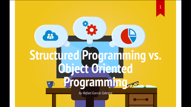

# Slide Show (S9) with Shower template docker container

- [rafagc/s9-shower docker container](https://hub.docker.com/r/rafagc/s9-shower)

- [Slide Show (S9) Guide (Book Edition)](https://slideshow-s9.github.io/)

- [Shower (Ribbon, Material) - Slide Show (S9) Template Pack](https://github.com/slideshow-templates/slideshow-shower)

## Example using Material Theme 

[](https://rafaies.github.io/s9-shower/generated-slides/oop/index.html)

[Structured Programming vs. Object Oriented Programming](https://rafaies.github.io/s9-shower/generated-slides/oop/index.html "Slide presentation using Shower template with Material theme")

From directory where the markdown file is (oop.md):

```
$ docker run -v $(pwd):/workspace -e INPUT=oop.md --rm rafagc/s9-shower
```
Some CSS changes have been made manually. Compare the generated file [oop.html](generated-slides/oop/oop.html) with the modified file [index.html](generated-slides/oop/index.html)

For example: class="cover" for background images and class="question".

## Example using Ribbon Theme 

[](https://rafaies.github.io/s9-shower/generated-slides/free-sw/index.html)

[Free Software](https://rafaies.github.io/s9-shower/generated-slides/free-sw/index.html "Slide presentation using Shower template with Ribbon theme")

From directory where the markdown file is (free-sw.md):

```
$ docker run -v $(pwd):/workspace -e INPUT=free-sw.md --rm rafagc/s9-shower
```

Some CSS changes have been made manually. Compare the generated file [free-sw.html](generated-slides/free-sw/free-sw.html) with the modified file [index.html](generated-slides/free-sw/index.html)

For example: class="cover" for background images and slide effect class="shout"


## MarkdownSlides

Another slide presentation made with [MarkdownSlides](https://github.com/asanzdiego/markdownslides "https://github.com/asanzdiego/markdownslides"):

- [Introduction to Computers, the Internet and Java](https://rafaies.github.io/intro-pro-slides/html/intro-pro-reveal-slides.html "Slides")

    - [No slides version](https://rafaies.github.io/intro-pro-slides/html/intro-pro-book.html)

- [github intro-pro-slides](https://github.com/rafaies/intro-pro-slides)


