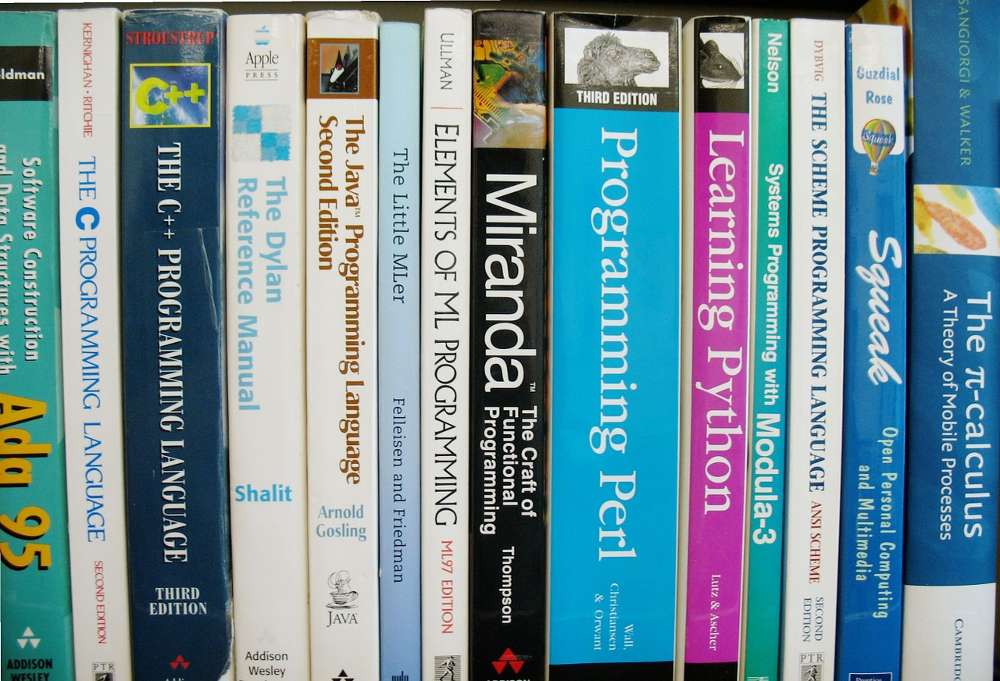
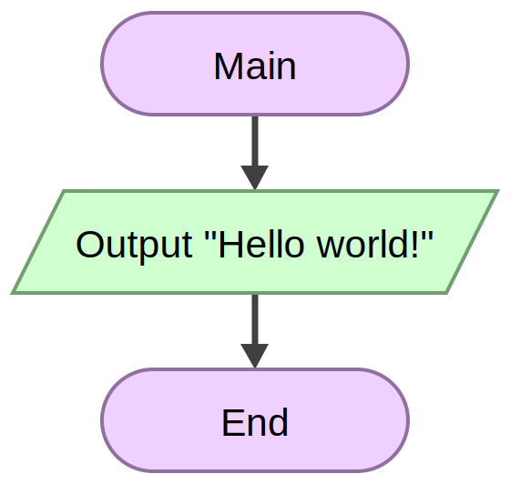
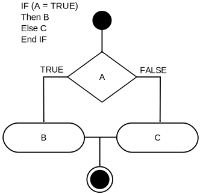

author: Rafael García Cabrera
title: Structured Programming vs. Object Oriented Programming
subtitle: IES Virgen del Carmen (Jaén)
cover: images/developer.png
lang: en
theme: ribbon

<!-- 
developer.png from
https://pixabay.com/photo-3461405/
Pixabay License
https://pixabay.com/es/service/license/
-->

## Programming Paradigms (I)
[Programming paradigms](https://en.wikipedia.org/wiki/Programming_paradigm) are a way to classify programming languages based on their features. 

A **programming paradigm** is a fundamental style of computer programming. 

Programming paradigms differ in how each element of the programs is represented and how steps are defined for solving problems. 

## Programming Paradigms (II)

Some paradigms are concerned mainly with implications for the [execution model](https://en.wikipedia.org/wiki/Execution_model) of the language, such as allowing [side effects](https://en.wikipedia.org/wiki/Side_effect_(computer_science)), or whether the sequence of operations is defined by the execution model. 

Other paradigms are concerned mainly with the way that code is organized, such as grouping a code into units along with the state that is modified by the code. 

Yet others are concerned mainly with the style of syntax and grammar.

## Common Programming Paradigms

- [imperative](https://en.wikipedia.org/wiki/Imperative_programming) in which the programmer instructs the machine how to change its state,
  - [procedural](https://en.wikipedia.org/wiki/Procedural_programming) which groups instructions into procedures,
  - [object-oriented](https://en.wikipedia.org/wiki/Object-oriented_programming) which groups instructions together with the part of the state they operate on,
- [declarative](https://en.wikipedia.org/wiki/Declarative_programming) in which the programmer merely declares properties of the desired result, but not how to compute it ([functional](https://en.wikipedia.org/wiki/Functional_programming "the desired result is declared as the value of a series of function applications"), [logic](https://en.wikipedia.org/wiki/Logic_programming "the desired result is declared as the answer to a question about a system of facts and rules"), [mathematical](https://en.wikipedia.org/wiki/Mathematical_programming "the desired result is declared as the solution of an optimization problem")) 

## Programming language

> A programming language is a [formal language](https://en.wikipedia.org/wiki/Formal_language), which comprises a [set of instructions](https://en.wikipedia.org/wiki/Instruction_set) used to produce various kinds of [output](https://en.wikipedia.org/wiki/Input/output). Programming languages are used in [computer programming](https://en.wikipedia.org/wiki/Computer_programming) to create programs that implement specific [algorithms](https://en.wikipedia.org/wiki/Algorithm "unambiguous specification of how to solve a class of problems").

[Programming language](https://en.wikipedia.org/wiki/Programming_language)

- [**List of programming languages by type**](https://en.wikipedia.org/wiki/List_of_programming_languages_by_type)

!SLIDE
<!-- 
developer.png from
https://pixabay.com/photo-942485/
Pixabay License
https://pixabay.com/es/service/license/
-->

## Multiparadigm programming languages
> Many of the most widely used programming languages (such as [Java](https://en.wikipedia.org/wiki/Java_(programming_language)), [Python](https://en.wikipedia.org/wiki/Python_(programming_language)), [C++](https://en.wikipedia.org/wiki/C%2B%2B), [PHP](https://en.wikipedia.org/wiki/PHP), [JavaScript](https://en.wikipedia.org/wiki/JavaScript) etc.) are **multiparadigm programming languages** that support object-oriented programming to a greater or lesser degree, typically in combination with imperative, procedural programming.

[Object-oriented programming](https://en.wikipedia.org/wiki/Object-oriented_programming)

- [**Comparison of multi-paradigm programming languages**](https://en.wikipedia.org/wiki/Comparison_of_multi-paradigm_programming_languages)

## Some languages

- [Java](https://en.wikipedia.org/wiki/Java_(programming_language)): object-oriented (class-based), structured, imperative, generic, reflective, concurrent.
- [Python](https://en.wikipedia.org/wiki/Python_(programming_language)): functional, imperative, object-oriented (class-based), reflective
- [C++](https://en.wikipedia.org/wiki/C%2B%2B): procedural, functional, object-oriented (class-based), generic.
- [PHP](https://en.wikipedia.org/wiki/PHP): imperative, functional, object-oriented (class-based), procedural, reflective
- [JavaScript](https://en.wikipedia.org/wiki/JavaScript): event-driven, functional, imperative, object-oriented (prototype-based)

 
## Object Oriented Programming (OOP) and Structured Programming are two programming paradigms.

As the name suggests, **OOP** focuses on representing problems using **real-world objects and their behavior**,

while **Structured Programming** deals with organizing the program in a **logical structure**.

## Structured Program Theorem (I)

>The **structured program theorem**, also called **Böhm-Jacopini theorem**, is a result in [programming language theory](https://en.wikipedia.org/wiki/Programming_language_theory). It states that a class of [control flow graphs](https://en.wikipedia.org/wiki/Control_flow_graph "A flowchart is a type of diagram that represents an algorithm, workflow or process") (historically called [charts](https://en.wikipedia.org/wiki/Flowchart "A flowchart is a type of diagram that represents an algorithm, workflow or process.") in this context) can compute any computable function if it combines subprograms in only three specific ways ([control structures](https://en.wikipedia.org/wiki/Control_structure)). 

[Structured program theorem](https://en.wikipedia.org/wiki/Structured_program_theorem)

## Structured Program Theorem (II)
The theorem states that it is possible to write any computer program by using only three basic control structures:

1. **[Sequence](https://en.wikibooks.org/wiki/Programming_Fundamentals/Flowcharts "Executing one subprogram, and then another subprogram")**: ordered statements or subroutines executed in sequence.
2. **[Selection](https://en.wikibooks.org/wiki/Programming_Fundamentals/Flowcharts "Executing one of two subprograms according to the value of a boolean expression")**: one or a number of statements is executed depending on the state of the program.
3. **[Iteration](https://en.wikibooks.org/wiki/Programming_Fundamentals/Flowcharts "Repeatedly executing a subprogram as long as a boolean expression is true")**: a statement or block is executed until the program reaches a certain state, or operations have been applied to every element of a collection.

## Control flow
> In computer science, **control flow** is the order in which individual [statements](https://en.wikipedia.org/wiki/Statement_(computer_science)), instructions or [function calls](https://en.wikipedia.org/wiki/Statement_(computer_science)) of an imperative program are [executed](https://en.wikipedia.org/wiki/Execution_(computing)) or evaluated. The emphasis on explicit control flow distinguishes an [imperative programming](https://en.wikipedia.org/wiki/Imperative_programming) language from a [declarative programming](https://en.wikipedia.org/wiki/Declarative_programming) language.

[Control flow](https://en.wikipedia.org/wiki/Control_flow)

## Sequence
<!-- 
https://commons.wikimedia.org/wiki/File:Flowgorithm_Hello_World.svg
Creative Commons Attribution-Share Alike 4.0 International license. 
-->

## Selection (Conditional)
> In [computer science](https://en.wikipedia.org/wiki/Computer_science), **conditional statements**, **conditional expressions** and **conditional constructs** are features of a [programming language](https://en.wikipedia.org/wiki/Programming_language), which perform different computations or actions depending on whether a programmer-specified [boolean](https://en.wikipedia.org/wiki/Boolean_datatype) condition evaluates to true or false. Apart from the case of [branch predication](https://en.wikipedia.org/wiki/Branch_predication), this is always achieved by selectively altering the [control flow](https://en.wikipedia.org/wiki/Control_flow) based on some condition. 

[Conditional (computer programming)](https://en.wikipedia.org/wiki/Conditional_(computer_programming))

## Selection
<!-- 
If-Then-Else-diagram.svg
By P. Kemp - own work created using Dia, CC0
https://commons.wikimedia.org/w/index.php?curid=1213392
Creative Commons CC0 1.0 Universal Public Domain Dedication. 
-->

## Iteration (While loop)
> In most computer programming languages, a **while loop** is a [control flow](https://en.wikipedia.org/wiki/Control_flow) [statement](https://en.wikipedia.org/wiki/Statement_(programming)) that allows code to be executed repeatedly based on a given [Boolean](https://en.wikipedia.org/wiki/Boolean_datatype) condition. The while loop can be thought of as a repeating [if statement](https://en.wikipedia.org/wiki/Conditional_(programming)). 

[While loop](https://en.wikipedia.org/wiki/While_loop)

## While loop
<!-- 
While-loop-diagram.svg
By P. Kemp - own work created using Dia, CC0
https://commons.wikimedia.org/w/index.php?curid=894438
Creative Commons CC0 1.0 Universal Public Domain Dedication. 
-->

## Iteration (Do while loop)
> In most computer programming languages, a **do while loop** is a [control flow](https://en.wikipedia.org/wiki/Control_flow) [statement](https://en.wikipedia.org/wiki/Statement_(programming)) that executes a block of code at least once, and then repeatedly executes the block, or not, depending on a given [boolean](https://en.wikipedia.org/wiki/Boolean_datatype) condition at the end of the block. 

[Do while loop](https://en.wikipedia.org/wiki/While_loop)

## Do while loop
<!-- 
Do-while-loop-diagram.svg
By P. Kemp - own work created using Dia, CC0
https://en.wikipedia.org/wiki/File:Do-while-loop-diagram.svg
Creative Commons CC0 1.0 Universal Public Domain Dedication.
-->

## Iteration (For loop)

> In computer science, a for-loop is a [control flow](https://en.wikipedia.org/wiki/Control_flow) [statement](https://en.wikipedia.org/wiki/Statement_(programming)) for specifying [iteration](https://en.wikipedia.org/wiki/Iteration), which allows code to be executed repeatedly.

A [For loop](https://en.wikipedia.org/wiki/For_loop) has two parts: a header specifying the iteration, and a body which is executed once per iteration. The header often declares an explicit [loop counter](https://en.wikipedia.org/wiki/For_loop#Loop_counters) or loop variable, which allows the body to know which iteration is being executed. For-loops are typically used when the number of iterations is known before entering the loop. For-loops can be thought of as shorthands for while-loops which increment and test a loop variable.

## For loop
<!-- 
For-loop-diagram.png
https://commons.wikimedia.org/wiki/File:For-loop-diagram.png
Creative Commons Attribution-Share Alike 2.5 Generic license. 
-->

## Iteration (foreach loop)
> **For each** (or **foreach**, sometimes called an **iterative for-loop**) is a [control flow](https://en.wikipedia.org/wiki/Control_flow) [statement](https://en.wikipedia.org/wiki/Statement_(programming)) for traversing items in a [collection](https://en.wikipedia.org/wiki/Collection_class). Foreach is usually used in place of a standard [for statement](https://en.wikipedia.org/wiki/For_loop). Unlike other for loop constructs, however, foreach loops usually maintain no explicit counter: they essentially say "do this to everything in this set", rather than "do this x times". This avoids potential [off-by-one errors](https://en.wikipedia.org/wiki/Off-by-one_error) and makes code simpler to read. In object-oriented languages an [iterator](https://en.wikipedia.org/wiki/Iterator), even if implicit, is often used as the means of traversal. 

[Foreach loop](https://en.wikipedia.org/wiki/Foreach_loop) 

## What is Structured Programming? (I)
It is assumed that the birth year of Structured Programming is 1970. Structured programming is considered a subset of imperative programming. 

[Imperative programming](https://en.wikipedia.org/wiki/Imperative_programming) is a programming paradigm that uses statements that change a program's state. In much the same way that the imperative mood in natural languages expresses commands, an imperative program consists of commands for the computer to perform. Imperative programming focuses on describing how a program operates.

## What is Structured Programming? (II)
> Structured programming is a [programming paradigm](https://en.wikipedia.org/wiki/Programming_paradigm) aimed at improving the clarity, quality, and development time of a [computer program](https://en.wikipedia.org/wiki/Computer_program) by making extensive use of the structured control flow constructs of selection ([if/then/else](https://en.wikipedia.org/wiki/Conditional_(computer_programming))) and repetition ([while](https://en.wikipedia.org/wiki/While_loop) and [for](https://en.wikipedia.org/wiki/For_loop)), [block structures](https://en.wikipedia.org/wiki/Block_(programming)), and [subroutines](https://en.wikipedia.org/wiki/Subroutines).

[Structured programming](https://en.wikipedia.org/wiki/Structured_programming)

## What is Object Oriented Programming? (I)
In **OOP**, the focus is on thinking about the problem to be solved in terms of real-world elements and representing the problem in terms of **objects** and their **behavior**. 

**Classes** depict the abstract representations of real world objects. Classes are like blueprints or templates, which gather similar items or things that can be grouped together. Classes have properties called **attributes** or **fields**. Attributes are implemented as global and instance variables. 

## What is Object Oriented Programming? (II)
**Methods** in the classes represent or define the behavior of these classes. Methods and attributes of classes are called the members of the class. An **instance of a class** is called an **object**. Therefore, an object is a data structure that closely resembles some real-world object.

There are several important **OOP concepts** such as **Data abstraction**, **Encapsulation**, **Polymorphism**, **Messaging**, **Modularity** and **Inheritance**.

Typically, **encapsulation** is achieved by making the **attributes private**, while creating **public methods** that can be used to access those attributes. 

## What is Object Oriented Programming? (III)
**Inheritance** allows the user to extend classes (called sub classes) from other classes (called super classes). 

**Polymorphism** allows the programmer to substitute an object of a class in place of an object of its super class. 

Typically, the *nouns* found in the problem definition directly become *classes* in the program. And similarly, *verbs* become *methods*. Some of the most popular OOP languages are [Java](https://en.wikipedia.org/wiki/Java_(programming_language)) and [C#](https://en.wikipedia.org/wiki/C_Sharp_(programming_language)).

## The key difference
The focus of **Structured Programming** is to structure the program in to a **hierarchy of subprograms** while, the focus of **OOP** is to break down the programming task in to **objects**, which **encapsulate data and methods**. 

*OOP* is considered **more flexible** than structured programming, because OOP separates a program in to a network of subsystems rather than structuring the program in to a hierarchy. Even though structuring provides certain clarity, a small change to a very large structured program may cause a ripple effect of having to change multiple subprograms.

## Focuses on process or data

*Structured Programming* is designed which focuses on **process**/ logical structure and then data required for that process.

*Object Oriented Programming* is designed which focuses on **data**.

## Top-down or bottom-up approach

*Structured programming* follows **top-down approach**.

*Object oriented programming* follows **bottom-up approach**.

## Modular programming vs. OOP Concepts

*Structured Programming* is also known as **Modular Programming** and a subset of **procedural programming language**.

*Object Oriented Programming* supports **inheritance**, **encapsulation**, **abstraction**, **polymorphism**, etc.

## Functions or Objects

In *Structured Programming*: Programs are divided into small self contained **functions**.

In *Object Oriented Programming*: Programs are divided into small entities called **objects**.

## Data hiding

*Structured Programming* is **less secure** as there is **no way of data hiding**.

*Object Oriented Programming* is **more secure** as having **data hiding feature**.

## Program complexity

*Structured Programming* can solve **moderately complex** programs.

*Object Oriented Programming* can solve **any complex** programs.

## Reusability

*Structured Programming* provides **less reusability**, more function dependency.

*Object Oriented Programming* provides **more reusability**, less function dependency.

## Abstraction

*Structured Programming*: **Less abstraction** and **less flexibility**.

*Object Oriented Programming*: **More abstraction** and **more flexibility**.

## Practice
<!-- 
developer.png from
https://pixabay.com/photo-1432921/
Pixabay License
https://pixabay.com/es/service/license/
-->

## Question 1
> **Follow top-down approach to program design**

Structured Programming Language

## Question 2
> **Follow bottom-up approach in program design**

Object Oriented Programming Language

## Question 3
> **Data and Functions don’t tide with each other**

Structured Programming Language

## Question 4
> **Data is hidden and can’t be accessed by the external world**

Object Oriented Programming Language

## Question 5
> **Large programs are divided into smaller self contained program segment known as functions**

Structured Programming Language

## Question 6
> **Functions are not dependent so reusability is possible**

Object Oriented Programming Language

## Question 7
> **A program is decomposed into a hierarchy of processes**

Structured Programming Language

## Question 8
> **It splits the program into objects that can be reused into other programs**

Object Oriented Programming Language

## Question 9
> **It is less secure as there is no way of data hiding**

Structured Programming Language

## Question 10
> **It can solve any complex programs**

Object Oriented Programming Language

## Web References

- [Difference Between Structured Programming and Object Oriented Programming](https://www.differencebetween.com/difference-between-structured-programming-and-vs-object-oriented-programming/)
- [Difference between Structured Programming and Object Oriented Programming - Structured Programming vs. Object Oriented Programming](https://freefeast.info/difference-between/difference-between-structured-programming-and-object-oriented-programming-structured-programming-vs-object-oriented-programming/)
- [The Computer Revolution/Programming/Object Oriented vs. Structured programming](https://www.differencebetween.com/difference-between-structured-programming-and-vs-object-oriented-programming/)

## Wikipedia References

- [Programming paradigm](https://en.wikipedia.org/wiki/Programming_paradigm)
- [Object-oriented programming](https://en.wikipedia.org/wiki/Object-oriented_programming)
- [Imperative programming](https://en.wikipedia.org/wiki/Imperative_programming)
- [Structured programming](https://en.wikipedia.org/wiki/Structured_programming)
- [Structured program theorem](https://en.wikipedia.org/wiki/Structured_program_theorem)
- [List of programming languages by type](https://en.wikipedia.org/wiki/List_of_programming_languages_by_type)
- [Control flow](https://en.wikipedia.org/wiki/Control_flow)

## Slide presentation credits

Slides generated from **Slide Show (S9)**:

- [Slide Show (S9) a free web alternative to PowerPoint and Keynote in Ruby](https://slideshow-s9.github.io/)
	- [License. The slide show scripts and templates are dedicated to the public domain. Use it as you please with no restrictions whatsoever.](https://slideshow-s9.github.io/#about)

- [Template: Shower HTML presentation engine](https://github.com/shower/shower)
	- [Licencia MIT](https://github.com/shower/shower/blob/master/LICENSE.md)
